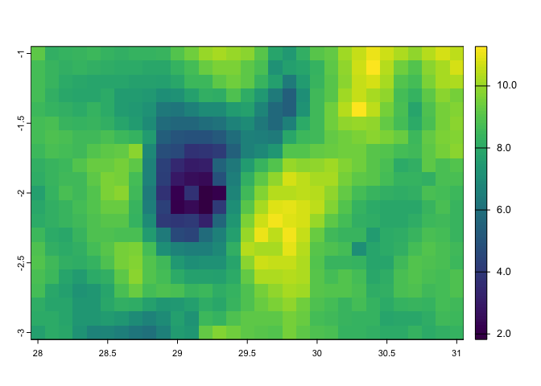

<!-- README.md is generated from README.Rmd. Please edit that file -->

# ncdfCF

<!-- badges: start -->

[](https://lifecycle.r-lib.org/articles/stages.html)
[](https://cran.r-project.org/package=ncdfCF)
[](https://cran.r-project.org/package=ncdfCF)
[](https://mit-license.org)
[](https://github.com/pvanlaake/ncdfCF/commits/main)
[](https://github.com/pvanlaake/ncdfCF/actions/workflows/R-CMD-check.yaml)
<!-- badges: end -->

The `ncdfCF` package provides an easy to use interface to netCDF
resources in R, either in local files or remotely on a THREDDS server.
It is built on the `RNetCDF` package which, like package `ncdf4`,
provides a basic interface to the `netcdf` library, but which lacks an
intuitive user interface. Package `ncdfCF` provides a high-level
interface using functions and methods that are familiar to the R user.
It reads the structural metadata and also the attributes upon opening
the resource. In the process, the `ncdfCF` package also applies CF
Metadata Conventions to interpret the data. This currently applies to:

- The **axis designation**. The three mechanisms to identify the axis
  each dimension represents are applied until an axis is determined.
- The **time dimension**. Time is usually encoded as an offset from a
  datum. Using the `CFtime` package these offsets can be turned into
  intelligible dates and times, for all 9 defined calendars.
- **Bounds** information. When present, bounds are read and used in
  analyses.
- **Discrete dimensions**, optionally with character labels. When labels
  are provided, these will be used as `dimnames` for the axis. (Note
  that this also applies to generic numeric axes with labels defined.)
- **Parametric vertical coordinates** are read, including variables
  listed in the `formula_terms` attribute.
- **Auxiliary coordinates** are identified and read. This applies to
  both **scalar axes** and **auxiliary longitude-latitude grids**. Data
  on non-Cartesian grids can be automatically rectified to a
  longitude-latitude grid if an auxiliary grid is present in the
  resource.
- The **grid_mapping** variables, providing the coordinate reference
  system (CRS) of the data, with support for all defined objects in the
  latest EPSG database as well as “manual” construction of CRSs.

##### Basic usage

Opening and inspecting the contents of a netCDF resource is very
straightforward:

``` r
library(ncdfCF)

# Get any netCDF file
fn <- system.file("extdata", "ERA5land_Rwanda_20160101.nc", package = "ncdfCF")

# Open the file, all metadata is read
(ds <- open_ncdf(fn))
#> <Dataset> ERA5land_Rwanda_20160101 
#> Resource   : /Library/Frameworks/R.framework/Versions/4.4-arm64/Resources/library/ncdfCF/extdata/ERA5land_Rwanda_20160101.nc 
#> Format     : offset64 
#> Type       : generic netCDF data 
#> Conventions: CF-1.6 
#> Keep open  : FALSE 
#> 
#> Variables:
#>  name long_name             units data_type axes                     
#>  t2m  2 metre temperature   K     NC_SHORT  longitude, latitude, time
#>  pev  Potential evaporation m     NC_SHORT  longitude, latitude, time
#>  tp   Total precipitation   m     NC_SHORT  longitude, latitude, time
#> 
#> Axes:
#>  id axis name      length unlim values                                       
#>  0  T    time      24     U     [2016-01-01 00:00:00 ... 2016-01-01 23:00:00]
#>  1  X    longitude 31           [28 ... 31]                                  
#>  2  Y    latitude  21           [-1 ... -3]                                  
#>  unit                             
#>  hours since 1900-01-01 00:00:00.0
#>  degrees_east                     
#>  degrees_north                    
#> 
#> Attributes:
#>  id name        type    length
#>  0  CDI         NC_CHAR  64   
#>  1  Conventions NC_CHAR   6   
#>  2  history     NC_CHAR 482   
#>  3  CDO         NC_CHAR  64   
#>  value                                             
#>  Climate Data Interface version 2.4.1 (https://m...
#>  CF-1.6                                            
#>  Tue May 28 18:39:12 2024: cdo seldate,2016-01-0...
#>  Climate Data Operators version 2.4.1 (https://m...

# ...or very brief details
names(ds)
#> [1] "t2m" "pev" "tp"
dimnames(ds)
#> [1] "time"      "longitude" "latitude"

# Variables and dimensions can be accessed through standard list-type extraction syntax
(t2m <- ds[["t2m"]])
#> <Variable> t2m 
#> Long name: 2 metre temperature 
#> 
#> Axes:
#>  id axis name      length unlim values                                       
#>  1  X    longitude 31           [28 ... 31]                                  
#>  2  Y    latitude  21           [-1 ... -3]                                  
#>  0  T    time      24     U     [2016-01-01 00:00:00 ... 2016-01-01 23:00:00]
#>  unit                             
#>  degrees_east                     
#>  degrees_north                    
#>  hours since 1900-01-01 00:00:00.0
#> 
#> Attributes:
#>  id name          type      length value              
#>  0  long_name     NC_CHAR   19     2 metre temperature
#>  1  units         NC_CHAR    1     K                  
#>  2  add_offset    NC_DOUBLE  1     292.664569285614   
#>  3  scale_factor  NC_DOUBLE  1     0.00045127252204996
#>  4  _FillValue    NC_SHORT   1     -32767             
#>  5  missing_value NC_SHORT   1     -32767

ds[["longitude"]]
#> <Longitude axis> [1] longitude
#> Length   : 31
#> Axis     : X 
#> Values   : 28, 28.1, 28.2 ... 30.8, 30.9, 31 degrees_east
#> Bounds   : (not set)
#> 
#> Attributes:
#>  id name          type    length value       
#>  0  standard_name NC_CHAR  9     longitude   
#>  1  long_name     NC_CHAR  9     longitude   
#>  2  units         NC_CHAR 12     degrees_east
#>  3  axis          NC_CHAR  1     X

# Regular base R operations simplify life further
dimnames(ds[["pev"]]) # A variable: list of dimension names
#> [1] "longitude" "latitude"  "time"
dimnames(ds[["longitude"]]) # A dimension: vector of dimension element values
#>  [1] 28.0 28.1 28.2 28.3 28.4 28.5 28.6 28.7 28.8 28.9 29.0 29.1 29.2 29.3 29.4
#> [16] 29.5 29.6 29.7 29.8 29.9 30.0 30.1 30.2 30.3 30.4 30.5 30.6 30.7 30.8 30.9
#> [31] 31.0

# Access attributes
ds[["pev"]]$attribute("long_name")
#> [1] "Potential evaporation"
```

If you just want to inspect what data is included in the netCDF
resource, use the `peek_ncdf()` function:

``` r
(ds <- peek_ncdf(fn))
#> $uri
#> [1] "/Library/Frameworks/R.framework/Versions/4.4-arm64/Resources/library/ncdfCF/extdata/ERA5land_Rwanda_20160101.nc"
#> 
#> $type
#> [1] "generic netCDF data"
#> 
#> $variables
#>     id name             long_name standard_name units                      axes
#> t2m  3  t2m   2 metre temperature            NA     K longitude, latitude, time
#> pev  4  pev Potential evaporation            NA     m longitude, latitude, time
#> tp   5   tp   Total precipitation            NA     m longitude, latitude, time
#> 
#> $axes
#>                     class id axis      name long_name standard_name
#> time           CFAxisTime  0    T      time      time          time
#> longitude CFAxisLongitude  1    X longitude longitude     longitude
#> latitude   CFAxisLatitude  2    Y  latitude  latitude      latitude
#>                                       units length unlimited
#> time      hours since 1900-01-01 00:00:00.0     24      TRUE
#> longitude                      degrees_east     31     FALSE
#> latitude                      degrees_north     21     FALSE
#>                                                  values has_bounds
#> time      [2016-01-01 00:00:00 ... 2016-01-01 23:00:00]      FALSE
#> longitude                                   [28 ... 31]      FALSE
#> latitude                                    [-1 ... -3]      FALSE
#> 
#> $attributes
#>   id        name    type length
#> 1  0         CDI NC_CHAR     64
#> 2  1 Conventions NC_CHAR      6
#> 3  2     history NC_CHAR    482
#> 4  3         CDO NC_CHAR     64
#>                                                                                                                                                                                                                                                                                                                                                                                                                                                                                                 value
#> 1                                                                                                                                                                                                                                                                                                                                                                                                                                    Climate Data Interface version 2.4.1 (https://mpimet.mpg.de/cdi)
#> 2                                                                                                                                                                                                                                                                                                                                                                                                                                                                                              CF-1.6
#> 3 Tue May 28 18:39:12 2024: cdo seldate,2016-01-01,2016-01-01 /Users/patrickvanlaake/CC/ERA5land/Rwanda/ERA5land_Rwanda_t2m-pev-tp_2016-2018.nc ERA5land_Rwanda_20160101.nc\n2021-12-22 07:00:24 GMT by grib_to_netcdf-2.23.0: /opt/ecmwf/mars-client/bin/grib_to_netcdf -S param -o /cache/data5/adaptor.mars.internal-1640155821.967082-25565-12-0b19757d-da4e-4ea4-b8aa-d08ec89caf2c.nc /cache/tmp/0b19757d-da4e-4ea4-b8aa-d08ec89caf2c-adaptor.mars.internal-1640142203.3196251-25565-10-tmp.grib
#> 4                                                                                                                                                                                                                                                                                                                                                                                                                                    Climate Data Operators version 2.4.1 (https://mpimet.mpg.de/cdo)
```

##### Extracting data

There are three ways to read data for a variable from the resource:

- **`data():`** The `data()` method returns all data of a variable,
  including its metadata, in a `CFData` instance.
- **`[]`:** The usual R array operator gives you access to the raw,
  non-interpreted data in the netCDF resource. This uses index values
  into the dimensions and requires you to know the order in which the
  dimensions are specified for the variable. With a bit of tinkering and
  some helper functions in `ncdfCF` this is still very easy to do.
- **`subset()`:** The `subset()` method lets you specify what you want
  to extract from each dimension in real-world coordinates and
  timestamps, in whichever order. This can also rectify non-Cartesian
  grids to regular longitude-latitude grids.

``` r
# Extract a timeseries for a specific location
ts <- t2m[5, 4, ]
str(ts)
#>  num [1, 1, 1:24] 293 292 292 291 291 ...
#>  - attr(*, "dimnames")=List of 3
#>   ..$ : chr "28.4"
#>   ..$ : chr "-1.3"
#>   ..$ : chr [1:24] "2016-01-01 00:00:00" "2016-01-01 01:00:00" "2016-01-01 02:00:00" "2016-01-01 03:00:00" ...
#>  - attr(*, "axis")= Named chr [1:3] "X" "Y" "T"
#>   ..- attr(*, "names")= chr [1:3] "longitude" "latitude" "time"
#>  - attr(*, "time")=List of 1
#>   ..$ time:Classes 'CFTime', 'R6' 2016-01-01 00:00:00 2016-01-01 01:00:00 2016-01-01 02:00:00 2016-01-01 03:00:00 2016-01-01 04:00:00 2016-01-01 05:00:00 2016-01-01 06:00:00 2016-01-01 07:00:00 2016-01-01 08:00:00 2016-01-01 09:00:00 2016-01-01 10:00:00 2016-01-01 11:00:00 2016-01-01 12:00:00 2016-01-01 13:00:00 2016-01-01 14:00:00 2016-01-01 15:00:00 2016-01-01 16:00:00 2016-01-01 17:00:00 2016-01-01 18:00:00 2016-01-01 19:00:00 2016-01-01 20:00:00 2016-01-01 21:00:00 2016-01-01 22:00:00 2016-01-01 23:00:00

# Extract the full spatial extent for one time step
ts <- t2m[, , 12]
str(ts)
#>  num [1:31, 1:21, 1] 300 300 300 300 300 ...
#>  - attr(*, "dimnames")=List of 3
#>   ..$ : chr [1:31] "28" "28.1" "28.2" "28.3" ...
#>   ..$ : chr [1:21] "-1" "-1.1" "-1.2" "-1.3" ...
#>   ..$ : chr "2016-01-01 11:00:00"
#>  - attr(*, "axis")= Named chr [1:3] "X" "Y" "T"
#>   ..- attr(*, "names")= chr [1:3] "longitude" "latitude" "time"
#>  - attr(*, "time")=List of 1
#>   ..$ time:Classes 'CFTime', 'R6' 2016-01-01 11:00:00
```

Note that the results contain degenerate dimensions (of length 1). This
by design when using basic `[]` data access because it allows attributes
to be attached in a consistent manner. When using the `subset()` method,
the data is returned as an instance of `CFData`, including axes and
attributes:

``` r
# Extract a specific region, full time dimension
(ts <- t2m$subset(list(X = 29:30, Y = -1:-2)))
#> <Data array> t2m 
#> Long name: 2 metre temperature 
#> 
#> Values: [283.0182 ... 299.917] K
#>     NA: 0 (0.0%)
#> 
#> Axes:
#>  id axis name      length unlim values                                       
#>  -1 X    longitude 10           [29 ... 29.9]                                
#>  -1 Y    latitude  10           [-1.1 ... -2]                                
#>   0 T    time      24     U     [2016-01-01 00:00:00 ... 2016-01-01 23:00:00]
#>  unit                             
#>                                   
#>                                   
#>  hours since 1900-01-01 00:00:00.0
#> 
#> Attributes:
#>  id name          type      length value              
#>  0  long_name     NC_CHAR   19     2 metre temperature
#>  1  units         NC_CHAR    1     K                  
#>  2  add_offset    NC_DOUBLE  1     292.664569285614   
#>  3  scale_factor  NC_DOUBLE  1     0.00045127252204996
#>  4  _FillValue    NC_SHORT   1     -32767             
#>  5  missing_value NC_SHORT   1     -32767

# Extract specific time slices for a specific region
# Note that the dimensions are specified out of order and using alternative
# specifications: only the extreme values are used.
(ts <- t2m$subset(list(T = c("2016-01-01 09:00", "2016-01-01 15:00"),
                       X = c(29.6, 28.8),
                       Y = seq(-2, -1, by = 0.05))))
#> <Data array> t2m 
#> Long name: 2 metre temperature 
#> 
#> Values: [288.2335 ... 299.917] K
#>     NA: 0 (0.0%)
#> 
#> Axes:
#>  id axis name      length values                                       
#>  -1 X    longitude  8     [28.8 ... 29.5]                              
#>  -1 Y    latitude  10     [-1.1 ... -2]                                
#>  -1 T    time       6     [2016-01-01 09:00:00 ... 2016-01-01 14:00:00]
#> 
#> Attributes:
#>  id name          type      length value              
#>  0  long_name     NC_CHAR   19     2 metre temperature
#>  1  units         NC_CHAR    1     K                  
#>  2  add_offset    NC_DOUBLE  1     292.664569285614   
#>  3  scale_factor  NC_DOUBLE  1     0.00045127252204996
#>  4  _FillValue    NC_SHORT   1     -32767             
#>  5  missing_value NC_SHORT   1     -32767
```

The latter two methods will read only as much data from the netCDF
resource as is requested.

##### Exporting and saving data

A `CFData` object can be exported to a `data.table` or to a
`terra::SpatRaster` (3D) or `terra::SpatRasterDataset` (4D) for further
processing. Obviously, these packages need to be installed to utilise
these methods.

``` r
# install.packages("data.table")
library(data.table)
head(dt <- ts$data.table())
#>    longitude latitude                time      t2m
#>        <num>    <num>              <char>    <num>
#> 1:      28.8     -1.1 2016-01-01 09:00:00 296.0753
#> 2:      28.9     -1.1 2016-01-01 09:00:00 294.9227
#> 3:      29.0     -1.1 2016-01-01 09:00:00 295.8135
#> 4:      29.1     -1.1 2016-01-01 09:00:00 297.0929
#> 5:      29.2     -1.1 2016-01-01 09:00:00 297.4697
#> 6:      29.3     -1.1 2016-01-01 09:00:00 298.5419

#install.packages("terra")
suppressMessages(library(terra))
(r <- ts$terra())
#> class       : SpatRaster 
#> dimensions  : 10, 8, 6  (nrow, ncol, nlyr)
#> resolution  : 0.1, 0.1  (x, y)
#> extent      : 28.75, 29.55, -2.05, -1.05  (xmin, xmax, ymin, ymax)
#> coord. ref. : lon/lat WGS 84 (EPSG:4326) 
#> source(s)   : memory
#> names       : 2016-~00:00, 2016-~00:00, 2016-~00:00, 2016-~00:00, 2016-~00:00, 2016-~00:00 
#> min values  :    290.0364,    288.9316,    288.7990,    288.3621,    288.3680,    288.2335 
#> max values  :    299.8894,    299.8691,    299.9066,    299.9170,    299.7626,    299.5948
terra::plot(r[names(r)[1]])
```



A `CFData` object can also be written back to a netCDF file. The object
will have all its relevant attributes and properties written together
with the actual data: axes, bounds, attributes, CRS.

``` r
# Save a CFData instance to a netCDF file on disk
ts$save("~/path/file.nc")
```

##### A note on Discrete Sampling Geometries

Discrete Sampling Geometries (DSG) map almost directly to the venerable
`data.frame` in R (with several exceptions). In that sense, they are
rather distinct from array-based data sets. At the moment there is no
specific code for DSG, but the simplest layouts can currently already be
read (without any warranty). Various methods, such as
`CFVariable::subset()` or `CFData::array()` will fail miserably, and you
are well-advised to try no more than the empty array indexing operator
`CFVariable::[]` which will yield the full data variable  
with column and row names set as an array, of `CFVariable::data()` to
get the whole data variable as a `CFData` object for further processing.
You can identify a DSG data set by the `featureType` attribute of the
`CFDataset`.

More comprehensive support for DSG is in the development plan.

## Development plan

Package `ncdfCF` is in the early phases of development. It supports
reading of groups, variables, dimensions, user-defined data types,
attributes and data from netCDF resources in “classic” and “netcdf4”
formats; and can write single data variables back to a netCDF file. From
the CF Metadata Conventions it supports identification of dimension
axes, interpretation of the “time” dimension, name resolution when using
groups, reading of “bounds” information, parametric vertical
coordinates, auxiliary coordinate variables, labels, and grid mapping
information.

Development plans for the near future focus on supporting the below
features:

##### netCDF

- Support for writing of data sets.

##### CF Metadata Conventions

- Calculate parametric vertical coordinates.
- Aggregation, using the CFA convention.
- Support for discrete sampling geometries.
- Interface to “standard_name” libraries and other “defined
  vocabularies”.
- Compliance with CMIP5 / CMIP6 requirements.

## Installation

**<span style="color: red;">CAUTION:</span>** Package `ncdfCF` is still
in the early phases of development. While extensively tested on multiple
well-structured datasets, errors may still occur, particularly in
datasets that do not adhere to the CF Metadata Conventions.

Installation from CRAN of the latest release:

    install.packages("ncdfCF")

You can install the development version of `ncdfCF` from
[GitHub](https://github.com/) with:

    # install.packages("devtools")
    devtools::install_github("pvanlaake/ncdfCF")
